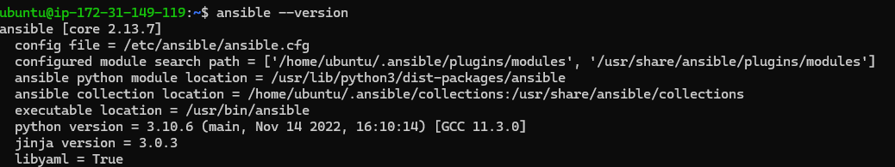
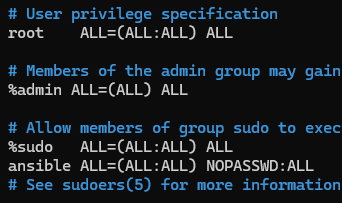
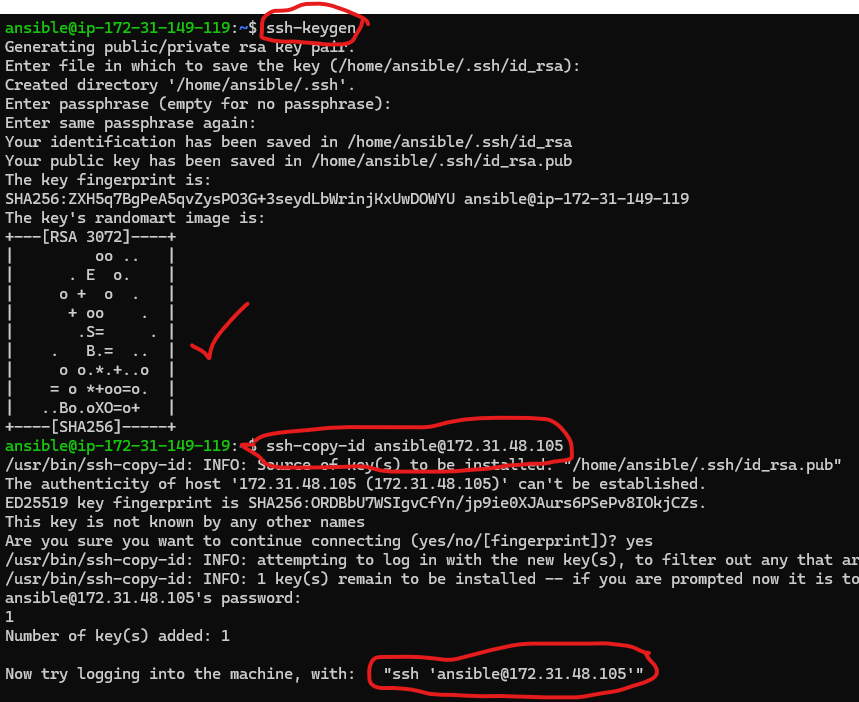

# Writing Playbooks in Ansible

* Create 2 instances. Name an instance as Ansible control node and node respectively
Install ansible in the first node. For installing: [Refer Here](https://linuxhint.com/install-configure-ansible-ubuntu/)

```text

sudo apt install software-properties-common
sudo add-apt-repository --yes --update ppa:ansible/ansible
sudo apt install ansible -y
```

* output:
 
* create a user in the 2 instances with the same name and password

```text
sudo adduser username
```

* ensure that user is added in the sudoers file in both the instances

```text
sudo visudo
```



* In Ansible Control Node (ACN), login to the user which you created and generate ssh key

```text
ssh-keygen
```

* after successful creation, copy the ssh key id into the node (by statying in the Ansible control node itself)

```text
ssh-copy-id username@privateIP_of_node
```

* Now try login to the node using the command shown in the screen. Let it be 

* exit from that machine and start working in the ACN.
* write an inventory/host file which contains the privateIP of the node

## Installing DotNet

* For installing dotnet manually [Refer here](https://learn.microsoft.com/en-us/dotnet/core/install/linux-ubuntu)

  steps:

  ```text
  wget https://packages.microsoft.com/config/ubuntu/22.10/packages-microsoft-prod.deb -O packages-microsoft-prod.deb
  sudo dpkg -i packages-microsoft-prod.deb
  rm packages-microsoft-prod.deb

  sudo apt-get update
  sudo apt-get install -y dotnet-sdk-7.0
  ```

* Let's write an Ansible playbook to install dotnet (playbook should always be a YAML file)
  [Refer Here](https://docs.ansible.com/ansible/2.9/modules/list_of_all_modules.html) for modules in Ansible.

  ```yaml
  ---
  - name: installing dotnet 7
  hosts: all
  become: yes
  tasks:
  - name: downloading the microsoft debian packages
    get_url:
      url: https://packages.microsoft.com/config/ubuntu/22.10/packages-microsoft-prod.deb
      dest: /tmp/packages-microsoft-prod.deb
    
  - name: installing debian package
    apt:
      deb: /tmp/packages-microsoft-prod.deb
    
  - name: installing donet 7
    apt:
      update_cache: true
      name: dotnet-sdk-7.0
      state: present

  ```

* use:

  ```text
  ansible-playbook -i inventory playbook_name --syntax-check (for checking syntax)

  ansible-playbook -i inventory playbook_name (for execution)
  ```

### let's write a playbook with variables to install Dotnet

 ```yaml
  ---
  - name: installing dotnet 
  hosts: all
  become: yes
  vars:
    dotnet_sdk_version: "dotnet-sdk-{{ version }}"
  tasks:
  - name: downloading the microsoft debian packages
    get_url:
      url: https://packages.microsoft.com/config/ubuntu/22.10/packages-microsoft-prod.deb
      dest: /tmp/packages-microsoft-prod.deb
    
  - name: installing debian package
    apt:
      deb: /tmp/packages-microsoft-prod.deb
    
  - name: installing donet 
    apt:
      update_cache: true
      name: "{{ dotnet_sdk_version }}"
      state: present

 ```

### Installing java

* Follow the steps to install java manually:

  ```text
  sudo apt update
  sudo apt install openjdk-version-jdk -y
  ```

* Let's write a playbook to install openjdk 11

  ```yaml
  ---
  - name: installing openjdk 11
    hosts: all
    become: true
    tasks:
      - name: updating the pacakges and installing java
        apt:
          name: openjdk-11-jdk
          update_cache: true
          state: present
  ```

* Let's write a playbook to install java with versions (using variables)

  ```yaml
  ---
  - name: installing java
    hosts: all
    become: true
    vars:
      java_version: "openjdk-{{ version }}-jdk"
    tasks:
      - name: updating the packages and installing java
        apt:
          name: "{{ java_version }}"
          update_cache: true
          state: present
  ```

### Installing nodejs and npm

* To install nodejs manually

  ```text
  sudo apt update
  sudo apt install nodejs -y
  ```

* Let's write a playbook to install nodejs

  ```yaml
  ---
  - name: installing nodejs
    hosts: all
    become: true
    task:
      - name: update the package and install nodejs
        apt:
          name: nodejs
          state: present
          update_cache: true
      - name: install npm
        apt:
          name: npm
          state: present
  ```
